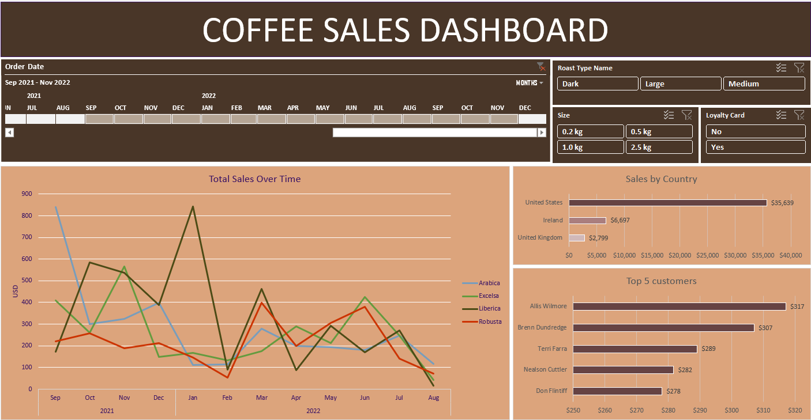

# Coffee_Sales_Analysis

## Project Overview

This project provides an in-depth analysis of coffee shop sales using advanced Excel techniques to derive actionable insights. From customer demographics to product metrics and business trends, this analysis presents a clear snapshot of key factors driving coffee sales. The insights can support data-driven decision-making in marketing, inventory management, and customer relations.

## Dashboard Sample

## Table of Contents

1. Key Objectives
2. Data Cleaning & Preparation
3. Techniques Used
4. Enhanced Data Visualization
5. Business Insights
6. Results

## Key Objectives
Our objectives in this project included:

**1. Customer Data Compilation**

Our objectives in this project included:

- Names: Extracted customer names using innovative methods.
- Emails: Derived customer email addresses using Excel's capabilities.
- Countries: Extracted customer countries through strategic Excel techniques.

**2. Product Data Extraction**

- Coffee Type: Categorized coffee types to help target preferences.
- Roast Type: Organized roast varieties for better understanding of product distribution.
- Size: Mapped sizes to inventory data for effective stock management.
- Unit Price: Retrieved prices, critical for analyzing revenue.

## Data Cleaning & Preparation

Before diving into analysis, the dataset was thoroughly cleaned:

Duplicate Removal: Eliminated duplicate entries to ensure data accuracy.
Missing Values: Filled in missing values or removed incomplete records where necessary.
Standardization: Standardized data formats for easier analysis (e.g., date formats, consistent product names).

## Techniques Used

To achieve the objectives, we used a combination of advanced Excel techniques, including:

- LOOKUP & INDEX/MATCH Functions: To map customer data efficiently.
- TEXT Functions: To format and extract specific text data, like splitting full names or parsing email domains.
- Conditional Formatting: For visually identifying trends and outliers.
- Pivot Tables: To summarize data and analyze trends by various dimensions.
- Charts & Graphs: Created insightful visualizations such as line charts, bar charts, and pie charts to depict data clearly.
  
## Enhanced Data Visualization

To facilitate quick comprehension, additional columns were introduced:

- Coffee Full Names: Created a column that maps short coffee names to full descriptions, enhancing readability.
- Roast Type Full Names: Expanded abbreviated roast types to full names for clarity in reporting.

## Business Insights
Our analysis yielded the following key insights:

- Total Sales Over Time: A clear visualization of sales trends, helping identify peak seasons and slow periods.
- Sales by Country: Revealed which countries contribute most to sales, enabling region-specific strategies.
- Top 5 Customers: Identified top customers based on purchase frequency and volume, valuable for loyalty programs.
 
## Results

Key takeaways from the project include:

**1. Seasonal Sales Patterns**: Insight into peak seasons can guide inventory and staffing decisions.
**2. Geographic Trends**: Countries with higher sales can be targeted with customized marketing.
**3. High-Value Customers**: Recognizing top customers allows for tailored loyalty programs to increase retention.
  

